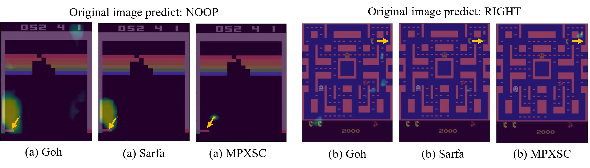
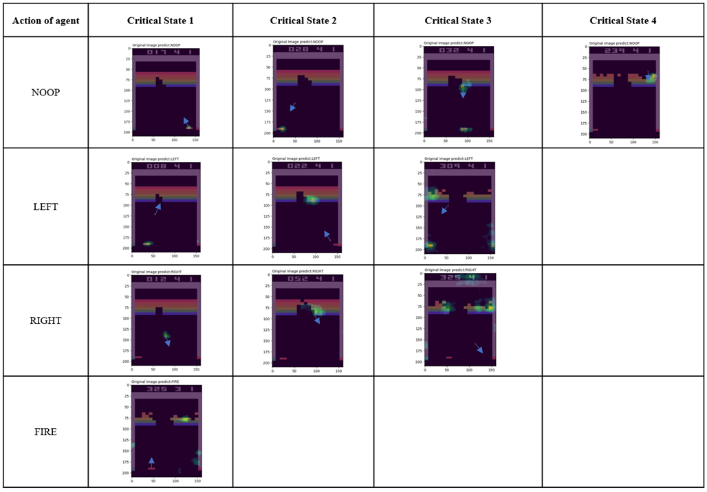

# MPXSC

> Codes for “Multi-granularity Policy Explanation of Deep Reinforcement Learning Based on Saliency Map Clustering”

## Method 

Explainable Deep Reinforcement Learning (XDRL) has great potential in clarifying the decision-making logic of agents in complex tasks. Current research in XDRL is increasingly fo-cused on multi-granularity policy explanation methods, which integrate both local and global decision explanations. Howev-er, most of them treat local and global explanations as sepa-rate processes, overlooking their interconnected nature and thereby compromising logical consistency. This paper intro-duces a Multi-granularity Policy eXplanation method based on Saliency map Clustering (MPXSC), which concurrently calculates both local and global policy explanations of a DRL agent in a unified, end-to-end process. MPXSC begins by employing super-pixel perturbation to generate saliency maps for all the agent’s states, representing its local explanation. These maps are then categorized by agent's actions and clus-tered based on local saliency features. Subsequently, the most critical states in each cluster are identified and serve as deci-sion rules for their respective actions. Collectively, these re-sults constitute the global explanation for the agent's decision-making. The superiority of MPXSC is validated through ob-jective experiments on local explanation and subjective sur-veys on global explanation, with a case study visually demonstrating the method’s compelling explainable evidence regarding DRL model prediction outcomes.

## System Requirements

- Device：`Legion Y7000P2020H, Windows 11 Enterprise Edition`

- CPU: `Intel(R) Core(TM) i7-10875H CPU @ 2.30GHz 2.30 GHz`

- GPU: `NVIDIA GeForce RTX 2060`

- Python installed (preferably Python 3.9)

- Relevant libraries and dependencies for the program are installed

  `pip install -r requirements.txt`

- A compatible CUDA-enabled GPU

## Running the Program

To execute the program, use the following command in your terminal:

```shell
#Play Breakout and explain by Goh、Sarfa and MPXSC
python main.py --agent=dql --eval=True --game_index=0
#Play MsPacman and explain by Goh、Sarfa and MPXSC
python main.py --agent=dql --eval=True --game_index=1
```

### Command Explanation

- `--agent {dql,dsac}    Deep Q-learning and discrete soft Actor-Critics algorithms.`
- `--live_penalty LIVE_PENALTY: Penalties when agent lose a life in the game.`
- `--reward_clip REWARD_CLIP: Clip reward in [-1, 1] range if True.`
- `--min_epsilon MIN_EPSILON: The probability for random actions.`
- `--start_epsilon START_EPSILON: The probability for random actions.`
- `--memory_size MEMORY_SIZE: The size of the memory space.`
- `--env_name ENV_NAME: The name of the gym atari environment.`
- `--game_index {0,1,2} : Represent Breakout, MsPacman and Pong respectively.`
- `--eval EVAL : True means evaluate model only.`

## Example Result

### Local decision explanation 




### Global policy explanation


