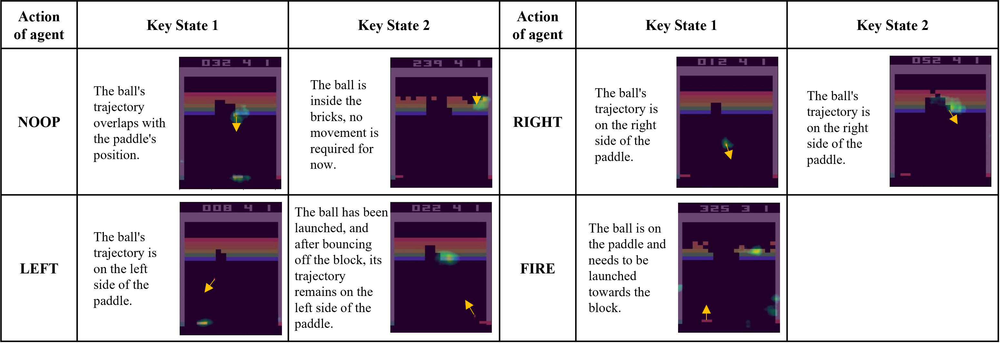

# MPXSC

> Codes for “The Multi-granularity Policy Explanation of Deep Reinforcement Learning Based on Saliency Map Clustering”

## Method 

As a branch of explainable artificial intelligence, explainable deep reinforcement learning (XDRL) exhibits tremendous potential in elucidating the decision-making logic of agents handling complex tasks. Presently, multi-granularity policy explanation methods, which comprehensively elucidate both local behaviors and global decisions of agents in a unified manner, are emerging as a focal point in the XDRL research domain. However, most multi-granularity policy explanations compute local and global interpretation results as two unrelated and independent processes, failing to exploit the interrelated characteristics, thereby affecting the logical consistency of multi-granularity policy explanations. This paper proposes a multi-granularity policy explanation method based on saliency map clustering, which simultaneously calculates the local interpretability of each decision in DRL and the globally interpretable decision rules in a single, independent end-to-end process. The globally interpretable decision rules fully leverage local interpretability results, ensuring the logical coherence of the agent's multi-granularity policy explanation. Firstly, a superpixel perturbation method is used to obtain the feature saliency map of the state under a single decision of the agent as its local decision explanation. Then, all local interpretation feature saliency maps are categorized according to the agent's decision action categories. Subsequently, the local explanation saliency maps under each decision action category are clustered, and the most influential key state frames in each cluster are identified. Finally, the key state sequences under each action category are integrated as the global explanation rules for the agent's decision-making while performing tasks. In real game scenarios, the proposed multi-granularity policy explanation method's superiority is thoroughly validated through objective comparative experiments on local interpretation results and subjective questionnaire surveys on global explanation rules. Furthermore, a case study visually demonstrates the effectiveness of the local decision explanation evidence and global explanation rules provided by this method.

## System Requirements

- Device：`Legion Y7000P2020H, Windows 11 Enterprise Edition`

- CPU: `Intel(R) Core(TM) i7-10875H CPU @ 2.30GHz 2.30 GHz`

- GPU: `NVIDIA GeForce RTX 2060`

- Python installed (preferably Python 3.9)

- Relevant libraries and dependencies for the program are installed

  `pip install -r requirements.txt`

- A compatible CUDA-enabled GPU

## Running the Program

To execute the program, use the following command in your terminal:

```shell
#Play Breakout and explain by Goh、Sarfa and MPXSC
python main.py --agent=dql --eval=True --game_index=0
#Play MsPacman and explain by Goh、Sarfa and MPXSC
python main.py --agent=dql --eval=True --game_index=1
```

### Command Explanation

- `--agent {dql,dsac}    Deep Q-learning and discrete soft Actor-Critics algorithms.`
- `--live_penalty LIVE_PENALTY: Penalties when agent lose a life in the game.`
- `--reward_clip REWARD_CLIP: Clip reward in [-1, 1] range if True.`
- `--min_epsilon MIN_EPSILON: The probability for random actions.`
- `--start_epsilon START_EPSILON: The probability for random actions.`
- `--memory_size MEMORY_SIZE: The size of the memory space.`
- `--env_name ENV_NAME: The name of the gym atari environment.`
- `--game_index {0,1,2} : Represent Breakout, MsPacman and Pong respectively.`
- `--eval EVAL : True means evaluate model only.`

## Example Result

### Local decision explanation 


### Global policy explanation


